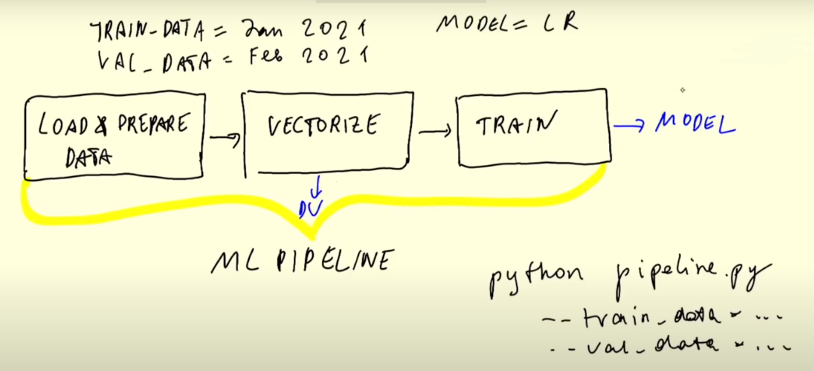
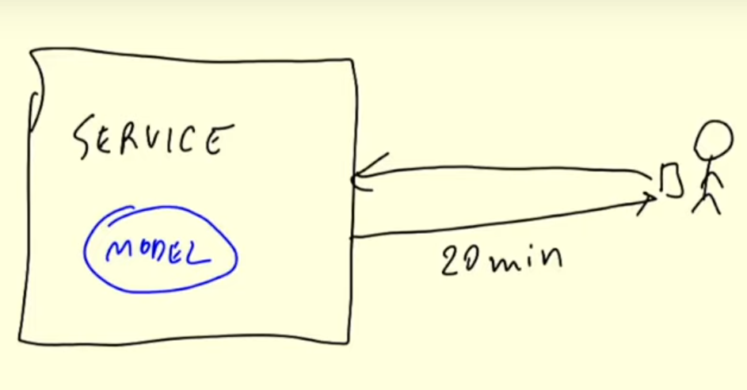

# MLOps

**MLOps** is a set of best practices for putting Machine Learning into production.

Machine Learning projects have 3 different stages (and MLOps helps in all 3 stages):

1. **Design**: Decide if ML the right tool for solving the problem.
2. **Train**: If ML is required, train and evaluate the best model.
3. **Operate**: Deploy and monitor the model.

### Experiment Tracking & Model Registries

Jupyter Notebooks are mainly used for experimentation and often best practices are not followed while writing code.

- *When cells are re-run with different values, the previous results are lost.* Insteading of maintining a markdown cell or a spreadsheet, we can use an **experiment tracker** to track all experiment results.
- *Cell execution order is not always apparent by looking at the code.* In the example [notebook](../code/1_notebook/duration-prediction.ipynb), we run the same cell to save the trained model but it is not clear which model was ultimately saved. We can use a **model registry** to track models that were built during the experiments.

### Orchestration & ML Pipelines

We can decompose the code for model training into separate identifyable steps and connect them to create an **ML pipeline** that can be parameterized.

### Model Serving

The trained model can be deployed in multiple ways. One method is to serve the model on the web.

### Model Monitoring

The deployed model needs to be monitored for performance.  A performance drop could trigger an alert so that a human can attend to the model, or it could trigger the pipeline to retrain and redeploy the model.

## MLOps Maturity Model

> Not every project needs to have the highest maturity level possible as it could exceed the project's budget.

**Level 0: No MLOps**
- All code in (sloppy) Jupyter notebooks
- No pipelines
- No experimentation tracking
- No metadata attached to model
- Good for PoC projects

**Level 1: DevOps but no MLOps**
- Releases are automated
- Unit tests and integration tests
- CI/CD
- Operational metrics
- Not ML aware (no experiment tracking, no reproducibility, data scientists are separated from engineers)

**Level 2: Automated training**
- Training pipeline
- Experiment tracking
- Model registry
- Low friction deployment
- Data scientists work with engineers in the same team

**Level 3: Automated deployment**
- Easy to deploy model
- A/B tests
- Model monitoring

**Level 4: Full MLOps automation**
- Automated training and deployment