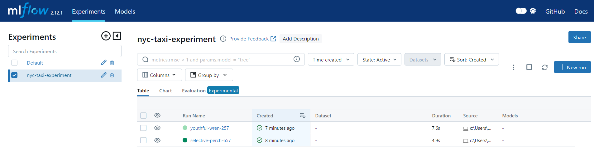

# Introduction to Experiment Tracking

**Experiment tracking** is the process of keeping track of all the relevant information from an ML experiment, which includes:

- Source code
- Environment
- Data
- Model
- Hyperparameters
- Metrics
- ...

> Relevant information may vary depending on the nature of the experiment.

Experiment tracking is important for 3 main reason:

1. **Reproducibility:** Our experiments need to be reproduccible in order to verify results in the future.
2. **Organization:** Experiment results need to be organized so that we know where to find past results.
3. **Optimization:** The usage of experiment tracking tools allows us to create more efficient workflows and automate  steps which are usually performed manually.

One of the most basic and common forms of experiment tracking is using a spreadsheet to track experiments, usually in the form of metrics from multiple tests. The cons of using a spreadsheet are as follows:

- **Error prone:** Manually copy-pasting results into a spreadsheet can introduce errors.
- **No standard format:** If a template isn't used and documented by all data scientists, there is a chance that experiment results could be misinterpreted.
- **Bad visibility and difficult collaboration:** Using spreadsheets for collaboration is difficult since each data scientist might present results differently.

# Introduction to MLflow

MLflow is an open source platform for the machine learning lifecycle. Its is a Python package that can be installed with `pip`.

MLflow contains 4 main modules:
- **Tracking:** This is used for experiment tracking
- **Models:** This is a standard format for packaging ML models that can be used in diverse serving environments
- **Model Registry:** This is used for managing models in MLflow
- **Projects:** This is a format for packaging code in a reusable and reproducible way

## Tracking experiments with MLflow

The MLflow Tracking module allows us to organize our experiments into runs. A run is a trial in a ML experiment. An experiment is made of runs, and each run keeps track of:
- Parameters
- Evaluation metrics
- Metadata
- Artifacts
- Models

Along with this information, MLflow automatically logs extra information about the run:
- Source code
- Code version (git commit)
- Start and end time
- Author

## Getting started with MLfLow

Install MLflow.

```
pipenv install mlflow
```

Change project directory.
```
cd code\2_mlflow
```

The MLfLow web UI can be accessed by running the `mlflow ui` command. We will need to provide a backend in order to save an retrieve experiment data. We can use SQLite as a backend.

```
mlflow ui --backend-store-uri sqlite:///mlflow.db
```

This will create a `mlflow.db` file in the folder we ran the command from. We should now be able to access the web UI by navigating to http://127.0.0.1:5000.

## Using MLflow with Jupyter Notebook

Create a subdirectory called `models` within the working directory so that MLflow can use it to store the models.

Copy the [notebook](../code/1_notebook/duration-prediction.ipynb) from the previous module into the working directory and modify it. Make sure the notebook is in the same directory as the `mlflow.db` file.

Import the MLflow library and set a few important parameters.

```python
import mlflow

mlflow.set_tracking_uri("sqlite:///mlflow.db")
mlflow.set_experiment("nyc-taxi-experiment")
```
- `set_tracking_uri` is used to point to the backend. The uri should match the uri provided when the `mlflow ui` command was run.
- `set_experiment` is used to define the name of the experiment.

MLflow creates this experiment if it doesn't already exist.

Next, load and prepare the data. Then use a `with` statement block to wrap the MLflow experiment tracking code.

```python
with mlflow.start_run():

    mlflow.set_tag("developer", "rebeka")

    mlflow.log_param("train-data-path", "./data/green_tripdata_2021-01.csv")
    mlflow.log_param("valid-data-path", "./data/green_tripdata_2021-02.csv")

    alpha = 0.1
    mlflow.log_param("alpha", alpha)

    lr = Lasso(alpha)
    lr.fit(X_train, y_train)

    y_pred = lr.predict(X_val)
    rmse = mean_squared_error(y_val, y_pred, squared=False)
    mlflow.log_metric("rmse", rmse)
```
- `mlflow.start_run()` returns the current active run, if one exists. The returned object is a [Python context manager](https://docs.python.org/2.5/whatsnew/pep-343.html), which means that we can use the `with` statement to wrap our experiment code and the run will automatically close once the statement exits.
- `mlflow.set_tag()` creates a key-value tag in the current active run. Tags are optional, but they are useful for large teams and organization purposes.
- `mlflow.log_param()` logs a single key-value param in the current active run.
- `mlflow.log_metrics()` logs a single key-value metric, which must always be a number. MLflow will remember the value history for each metric.

Now, if we nagivate to the [MLflow UI](http://127.0.0.1:5000), we should be able to see the experiment runs.



## Experiment tracking using MLflow

### Hyperparameter tuning using `hyperopt`

The `hyperopt` library is used for distributed hyperparameter optimization. We will import the following functions from the `hyperopt` library:

```python
from hyperopt import fmin, tpe, hp, STATUS_OK, Trials
from hyperopt.pyll import scope
```
- `fmin` is used for minimizing the objective function
- `tpe` is the algorithm that is provided for minimizing the objective function
- `hp` is used for defining the search space for hyperparameter tuning
- `STATUS_OK` is a signal for letting hyperopt know that the objective function has run successfully
- `Trials` is used for keeping track of information from each run
- `scope` is used for defining ranges

First, we need to define an **objective function**.

```python
import xgboost as xgb

train = xgb.DMatrix(X_train, label=y_train)
valid = xgb.DMatrix(X_val, label=y_val)

def objective(params):

    with mlflow.start_run():
        mlflow.set_tag("model", "xgboost")
        mlflow.log_params(params)
        booster = xgb.train(
            params=params,
            dtrain=train,
            num_boost_round=1000,
            evals=[(valid, 'validation')],
            early_stopping_rounds=50
        )
        y_pred = booster.predict(valid)
        rmse = mean_squared_error(y_val, y_pred, squared=False)
        mlflow.log_metric("rmse", rmse)

    return {'loss': rmse, 'status': STATUS_OK}
```
- `hyperopt` optimizes the metric returned by the objective function. In this example, the metric is RMSE
* `STATUS_OK` signal is returned to let `hyperopt` know that the optimization was successful

Next, we need to define the **search space**. The search space refers to the ranges in which we want `hyperopt` to explore the hyperparameters.

```python
search_space = {
    'max_depth': scope.int(hp.quniform('max_depth', 4, 100, 1)),
    'learning_rate': hp.loguniform('learning_rate', -3, 0),
    'reg_alpha': hp.loguniform('reg_alpha', -5, -1),
    'reg_lambda': hp.loguniform('reg_lambda', -6, -1),
    'min_child_weight': hp.loguniform('min_child_weight', -1, 3),
    'objective': 'reg:linear',
    'seed': 42
}
```
- `hp.quniform()` returns discreet (float) values in intervals of `q` following a uniform distribution between `a` and `b`.
- `scope.int()` is used for converting a range of float to a range of int
- `hp.loguniform()` returns the exponential of a number between `a` and `b` following a uniform distribution.

Next we need to **minimize the objective function** by calling the `fmin` function.

```python
best_result = fmin(
    fn=objective,
    space=search_space,
    algo=tpe.suggest,
    max_evals=50,
    trials=Trials()
)
```
- `fn` receives the objective function
- `space` receives the search space
- `algo` defines the search algorithm
- `tpe` is an algorithm for hyperparameter optimization. `tpe.suggest` is the default choice for almost all projects.
- `max_evals` defines the maximum amount of evaluation iterations for hyperparameter search
- `trials` receives an object with the dictionaries returned by the objective function

### Comparing experiment results

The experiment results can be found in the MLflow UI.

We can lookup specific runs in the search bar using tags. In this example, we search for all `xgboost` model runs.


We can select multiple runs and compare them using the following visualizations.
- Parallel Coordinates Plot
- Scatter Plot
- Box Plot
- Contour Plot

To select the best model we can sort the search results to find the model with the best performance. We should also take into account the model complexity (eg. runtime) before making a decision

### Automatic logging

So far we have only tracked the hyperparameter values but not the model weights. Once we have selected the best model, we can use its hyperparameter values to train the model once more and save the model.

Instead of wrapping the training code within `with mlflow.start_run()`, we can use **automatic logging**. Automatic logging tracks every detail about the model training without the need to specify what to track. However, training time is slightly longer since MLflow needs to log a lot of data.

```python
params = {
  'learning_rate': 0.09585355369315604,
  'max_depth': 30,
  'min_child_weight': 1.060597050922164,
  'objective': 'reg:linear',
  'reg_alpha': 0.018060244040060163,
  'reg_lambda': 0.011658731377413597,
  'seed': 42
}

mlflow.xgboost.autolog()

booster = xgb.train(
  params=params,
  dtrain=train,
  num_boost_round=1000,
  evals=[(valid, 'validation')],
  early_stopping_rounds=50
)
```

The model training details tracked in MLflow include (but is not limited to):
- run start time, run duration
- datasets used
- model algorithm
- hyperparameters
- model metrics
- package versions
- trained model
- feature importance

## Model tracking using MLflow


**Model management** includes experiment tracking, model versioning, model deployment, and hardware scaling.

A basic method of model versioning is to use folder systems. The cons of this method are as follows:

- **Error prone:** Manually renaming folders and moving them around can introduce errors.
- **No versioning:** Filenames could be used for model versioning but lack of a standard template can lead to misinterpretations.
- **No model lineage:** It is not easy to understand how the models were created, what hyperparameters were tuned, what datasets were used for training, etc.

### Tracking model artifacts

An easy way to manage models in MLFlow is to track the model as an **artifact**. This can be achieved using the `mlflow.log_artifact()` method inside the `with` statement block to wrap the MLflow experiment tracking code.

```python
with mlflow.start_run():

    mlflow.set_tag("developer", "cristian")

    mlflow.log_param("train-data-path", "./data/green_tripdata_2021-01.csv")
    mlflow.log_param("valid-data-path", "./data/green_tripdata_2021-02.csv")

    alpha = 0.1
    mlflow.log_param("alpha", alpha)

    lr = Lasso(alpha)
    lr.fit(X_train, y_train)

    y_pred = lr.predict(X_val)
    rmse = mean_squared_error(y_val, y_pred, squared=False)
    mlflow.log_metric("rmse", rmse)

    # track model artifact
    mlflow.log_artifact(local_path="models/lin_reg.bin", artifact_path="models_pickle")
```
- `mlflow.log_artifact()` logs a local file or directory as an artifact of the currently active run. If no run is active, this function will create a new active run.
- `local_path` is the path of the file to write.
- `artifact_path` is the directory in `artifact_uri` to write to.

A limitation of artifact tracking for model management is that it can be unconvenient to search for a model, download the bin file, write code to load the model, and then run predictions.

### Model logging

A better way to manage models in MLflow is to use model logging. MLflow offers model logging for specific frameworks. The model object and the artifact path are passed as input parameters to the `mlflow.<framework>.log_model()` method. 

We can also log the DictVectorizers used to preprocess the data to run new predictions later.

The following code uses the `xgboost` framework and upon running it creates new folders called `models_mlflow` and `preprocessor` in the web UI under the **Artifacts** section:

```python
with mlflow.start_run():
    
    train = xgb.DMatrix(X_train, label=y_train)
    valid = xgb.DMatrix(X_val, label=y_val)

    best_params = {
        'learning_rate': 0.09585355369315604,
        'max_depth': 30,
        'min_child_weight': 1.060597050922164,
        'objective': 'reg:linear',
        'reg_alpha': 0.018060244040060163,
        'reg_lambda': 0.011658731377413597,
        'seed': 42
    }

    mlflow.log_params(best_params)

    booster = xgb.train(
        params=best_params,
        dtrain=train,
        num_boost_round=1000,
        evals=[(valid, 'validation')],
        early_stopping_rounds=50
    )

    y_pred = booster.predict(valid)
    rmse = mean_squared_error(y_val, y_pred, squared=False)
    mlflow.log_metric("rmse", rmse)

    # log input data (DictVectorizers)
    with open("models/preprocessor.b", "wb") as f_out:
        pickle.dump(dv, f_out)

    # log model
    mlflow.xgboost.log_model(booster, artifact_path="models_mlflow")
```

### Making predictions

MLflow automatically generates code snippets to make predictions using the logged model.

MLflow stores the model in a format that allows us to load it in different "flavors". For example, the XGBoost model can be loaded as an `XGBoost` model or as a `PyFuncModel`.

```python
logged_model = 'runs:/.../models_mlflow'

# load model as a PyFuncModel
loaded_model = mlflow.pyfunc.load_model(logged_model)

# load model as a XGBoost model
xgboost_model = mlflow.xgboost.load_model(logged_model)

y_pred = xgboost_model.predict(valid)
```

## Model registry


A **model registry** is a centralized model store that is used to version control machine learning models. It is used to collaboratively manage the full lifecycle of an MLflow Model. It provides model lineage, model versioning, model aliasing, model tagging, and annotations.

A data scientist may use **MLflow tracking server** to track the development of experimental models and then register the model in **MLflow model registry** once the model is ready for deployment. Then, a deployment engineer may inspect the models and assign them to a stage - **staging**, **production**, or **archive**.

### Promoting models to the model registry

The model with the best model metrics might not be the best model. Other parameters like model size, training time, inference time need to be considered based on the goals of the project to decide which model should be deployed. Once the best models are selected, they can be promoted to the model registry.

In the MLflow web UI under the `Experiments` tab, one can register a model by clicking on the `Register model` button and entering a model name. The same model name can be selected if one is promoting multiple models for the same experiment. The registry will track them as different versions.


The model registry can be accessed by navigating to the `Models` tab in the MLflow web UI. Upon clicking on a model, one should be able to see all the available versions of that model. One should also be able to add descriptions and tags to the models.

All versions of a registered model are assigned the `None` stage by default. A model version can be transitioned to a different stage by clicking into the version and then selecting the appropriate stage from the `Stage` drop-down menu. Clicking on any of the available options will show a pop-up window providing the option to transition older models in the chosen stage to the `archived` stage.


### Interacting with the tracking and registry server using Python

The `MlflowClient` object allows us to interact with:
- an **MLflow Tracking Server** that creates and manages experiments and runs.
- an **MLflow Registry Server** that creates and manages registered models and model versions.

```python
from mlflow.tracking import MlflowClient

MLFLOW_TRACKING_URI = "sqlite:///mlflow.db"
client = MlflowClient(tracking_uri=MLFLOW_TRACKING_URI)

# list all available experiments
client.search_experiments()
```

To create a new experiment, run the following code:

```python
client.create_experiment(name="my-cool-experiment")
```

To check the latest versions for the experiment with id `1`, run the following code:

```python
from mlflow.entities import ViewType

runs = client.search_runs(
    experiment_ids='1',
    filter_string="metrics.rmse < 7",
    run_view_type=ViewType.ACTIVE_ONLY,
    max_results=5,
    order_by=["metrics.rmse ASC"]
)

for run in runs:
    print(f"run id: {run.info.run_id}, rmse: {run.data.metrics['rmse']:.4f}")
```
- `experiment_ids` is a string with the experiment ID we want to search. In this example, the ID for `nyc-taxi-experiment` is `1`.
- `filter_string` is a filtering query. In this example, we want to filter only the runs with a RMSE value smaller than 7.
- `run_view_type` is an enum with the type of runs we want to filter to. Accepted values are `ViewType.ACTIVE_ONLY`, `ViewType.DELETED_ONLY` and `ViewType.ALL`.
- `max_results` limits the number of results.
- `order_by` is used to order the results by a particular field.

To programatically promote a model to the model registry, run the following code:

```python
import mlflow

mlflow.set_tracking_uri(MLFLOW_TRACKING_URI)

run_id = "164b87b2300b4d31997652d119594f87"
model_uri = f"runs:/{run_id}/model"
mlflow.register_model(model_uri=model_uri, name="nyc-taxi-regressor")
```

To transition a model to a new stage, first identify the model version to transition. Then run the code to transition model version stage:

```python
model_name = "nyc-taxi-regressor"
latest_versions = client.get_latest_versions(name=model_name)

for version in latest_versions:
    print(f"version: {version.version}, stage: {version.current_stage}")

model_version = 4
new_stage = "Staging"
client.transition_model_version_stage(
    name=model_name,
    version=model_version,
    stage=new_stage,
    archive_existing_versions=False
)
```

To annotate a model version (eg. update description), run the following code:

```python
from datetime import datetime
date = datetime.today().date()

client.update_model_version(
    name=model_name,
    version=model_version,
    description=f"The model version {model_version} was transitioned to {new_stage} on {date}"
)
```

### Comparing models

In this = section, we will retrieve models registered in the model registry and compare their performance on an unseen test set. The idea is to simulate the scenario in which a deployment engineer has to interact with the model registry to decide whether to update the model version that is in production or not.

These are the steps:

1. Load the test dataset, which corresponds to the NYC Green Taxi data from the month of March 2021.
2. Download the `DictVectorizer` that was fitted using the training data and saved to MLflow as an artifact, and load it with pickle.
3. Preprocess the test set using the `DictVectorizer` so we can properly feed the regressors.
4. Make predictions on the test set using the model versions that are currently in the "Staging" and "Production" stages, and compare their performance.
5. Based on the results, update the "Production" model version accordingly.

> The model registry doesn't actually deploy the model to production when we transition a model to the "Production" stage, it just assigns a label to that model version. We need to complement the registry with some CI/CD code that does the actual deployment.

Load and preprocess the [March 2021 green taxi data](https://d37ci6vzurychx.cloudfront.net/trip-data/green_tripdata_2021-03.parquet) from NYC TLC Trip Records:

```python
from sklearn.metrics import root_mean_squared_error
import pandas as pd


def read_dataframe(filename):
    df = pd.read_parquet(filename)

    df.lpep_dropoff_datetime = pd.to_datetime(df.lpep_dropoff_datetime)
    df.lpep_pickup_datetime = pd.to_datetime(df.lpep_pickup_datetime)

    df['duration'] = df.lpep_dropoff_datetime - df.lpep_pickup_datetime
    df.duration = df.duration.apply(lambda td: td.total_seconds() / 60)

    df = df[(df.duration >= 1) & (df.duration <= 60)]

    categorical = ['PULocationID', 'DOLocationID']
    df[categorical] = df[categorical].astype(str)
    
    return df


def preprocess(df, dv):
    df['PU_DO'] = df['PULocationID'] + '_' + df['DOLocationID']
    categorical = ['PU_DO']
    numerical = ['trip_distance']
    train_dicts = df[categorical + numerical].to_dict(orient='records')
    return dv.transform(train_dicts)


def test_model(name, stage, X_test, y_test):
    model = mlflow.pyfunc.load_model(f"models:/{name}/{stage}")
    y_pred = model.predict(X_test)
    return {"rmse": root_mean_squared_error(y_test, y_pred)}


df = read_dataframe("data/green_tripdata_2021-03.parquet")
```

Download the preprocessor from MLflow model registry:

```python
run_id = "b8904012c84343b5bf8ee72aa8f0f402"
client.download_artifacts(run_id=run_id, path='preprocessor', dst_path='.')
```
- `dst_path` is the path of the local filesystem destination directory to which to download the specified artifacts. In this example, we download to the same folder that contains our code.

Load the preprocessor and prepare the data:

```python
import pickle

with open("preprocessor/preprocessor.b", "rb") as f_in:
    dv = pickle.load(f_in)

X_test = preprocess(df, dv)

target = "duration"
y_test = df[target].values
```

Test (and benchmark) the models:

```python
model_name = "nyc-taxi-regressor"

%time test_model(name=model_name, stage="Production", X_test=X_test, y_test=y_test)

%time test_model(name=model_name, stage="Staging", X_test=X_test, y_test=y_test)
```

Now we can now compare model performances and decide if we want to transition a model to production/ archive previous production models (using `transition_model_version_stage()`).

## MLflow in practice